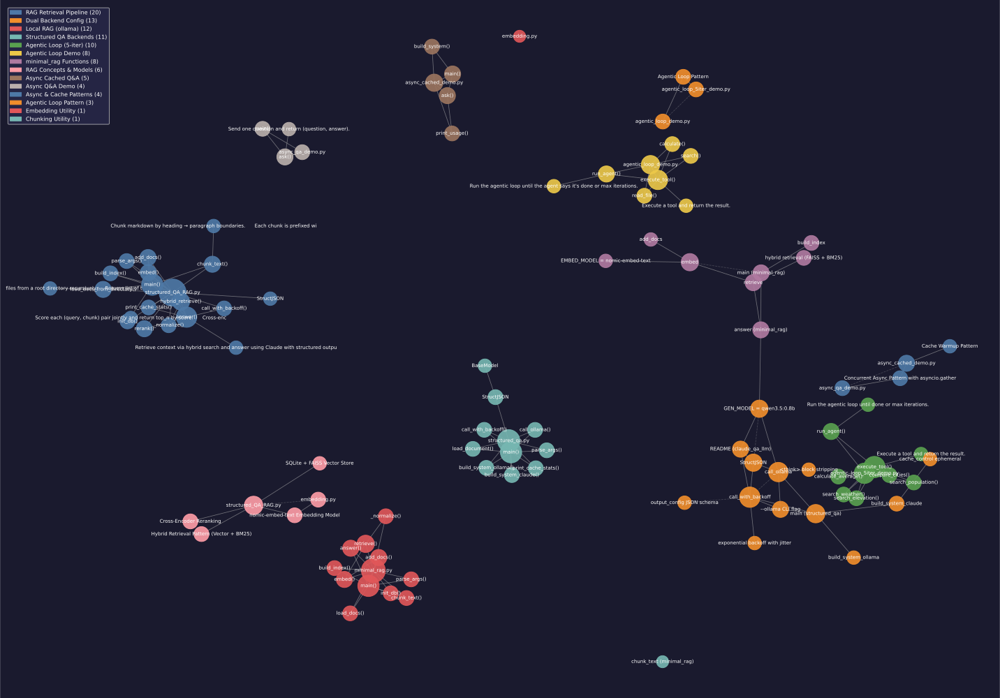

# claude_qa_llm

A CLI toolkit for document Q&A using Claude. Ranges from a simple single-document chatbot to a full RAG pipeline with hybrid retrieval and cross-encoder reranking.

---

## Tools

| File | What it does |
|---|---|
| `structured_QA_RAG.py` | Full RAG pipeline — load a directory of markdown docs, chunk, embed, retrieve, rerank, answer with Claude |
| `structured_qa.py` | Single-document Q&A — Claude (prompt-cached) or ollama (`qwen3.5:0.8b`) backend |
| `minimal_rag.py` | Fully local RAG with FAISS + BM25 hybrid search and local LLM via ollama — no API key needed |
| `qa.py` | Simple streaming Q&A for a single document |
| `embedding.py` | Standalone embedding example using ollama |

---

## structured_QA_RAG.py

The main tool. Ingests a directory of markdown files into a SQLite + FAISS index, then answers questions using a three-stage retrieval pipeline backed by Claude Sonnet.

### Pipeline

```
Markdown files
     │
     ▼
 chunk_text()          Heading-aware chunking: splits on # headings then blank
     │                 lines (paragraphs). Each chunk is prefixed with its
     │                 section heading. Small paragraphs are merged; oversized
     │                 ones fall back to word-splitting with overlap.
     ▼
 add_docs()            Embeds each chunk with nomic-embed-text (via ollama)
     │                 and stores text + embedding + filename in SQLite.
     │                 INSERT OR IGNORE makes re-runs safe.
     ▼
 build_index()         Loads all embeddings from SQLite into a FAISS
     │                 IndexFlatL2 (exact search, no training required).
     │                 Builds a BM25Okapi index over the same corpus.
     ▼
── per query ──────────────────────────────────────────────────────────
     ▼
 hybrid_retrieve()     Fetches k×3 candidates from FAISS (default k=20, so 60
     │                 candidates), scores them with BM25, normalizes both,
     │                 combines (α semantic + 1-α lexical), returns top k.
     ▼
 rerank()              Cross-encoder (ms-marco-MiniLM-L-6-v2) scores each
     │                 (query, chunk) pair jointly — more accurate than
     │                 independent embeddings. Returns top_n (default 10).
     ▼
 answer()              Assembles context into the user message (system prompt
                       is a static cached constant). Calls Claude Sonnet with
                       JSON schema output_config. Appends Q+A to history for
                       multi-turn follow-ups.
```

### Setup

```bash
pip install -r requirements.txt
echo "ANTHROPIC_API_KEY=your_key" > .env

# ollama must be running with the embedding model pulled
ollama pull nomic-embed-text
```

### Usage

```bash
# Interactive mode
python structured_QA_RAG.py /path/to/docs

# Single question
python structured_QA_RAG.py /path/to/docs -q "What is the installation process?"

# Tune retrieval hyperparameters
python structured_QA_RAG.py /path/to/docs -k 30 --top-n 15 --alpha 0.5

# Full help
python structured_QA_RAG.py --help
```

On first run the cross-encoder model (~85MB) is downloaded once and cached by `sentence-transformers`.

Delete `rag.db` before re-ingesting with different documents or chunk settings:
```bash
rm rag.db && python structured_QA_RAG.py /path/to/docs
```

### Flags

| Flag | Default | Effect |
|---|---|---|
| `directory` | `.` | Root directory to load markdown files from |
| `-q`, `--question` | — | Ask a single question and exit; omit for interactive mode |
| `-k` | `20` | Candidates fetched by hybrid retrieval before reranking |
| `--top-n` | `10` | Chunks passed to Claude after reranking |
| `--alpha` | `0.7` | Semantic (vector) vs lexical (BM25) weight, `0.0`–`1.0` |

**Tuning tips:**
- Increase `-k` if relevant chunks are being missed; decrease to speed up reranking
- Lower `--alpha` (e.g. `0.5`) for docs with specific terminology, version numbers, or code identifiers where keyword matching matters more
- Increase `--top-n` for broad questions that span multiple sections

### Chunk parameters

These are set in code rather than flags as they require re-ingestion to take effect:

| Parameter | Default | Location | Effect |
|---|---|---|---|
| `max_words` | `150` | `chunk_text()` | Max words per chunk |
| `min_words` | `30` | `chunk_text()` | Min before merging adjacent paragraphs |

### Output

Answers are printed to stdout. Cache stats and the reranked context list are printed to stderr each turn so you can inspect what Claude saw without polluting piped output.

---

## structured_qa.py

Single-document Q&A with two backends. Loads one file, then answers questions in a loop.

```bash
# Claude (default) — prompt-cached, structured JSON output via output_config
python structured_qa.py path/to/document.md

# ollama — local inference, no API key required
python structured_qa.py path/to/document.md --ollama
```

| | Claude (`claude-sonnet-4-6`) | ollama (`qwen3.5:0.8b`) |
|---|---|---|
| API key | Required | Not required |
| Prompt caching | 5-min cache on system prompt | None |
| JSON enforcement | `output_config` schema | `format="json"` + regex fallback |
| `<think>` blocks | Not emitted | Stripped before parsing |

Responses are structured JSON `{"Q": "...", "A": "..."}`. Conversation history is maintained across turns so follow-up questions work correctly.

---

## minimal_rag.py

Fully local RAG — no Claude API required. Embeds with `nomic-embed-text` and answers with a small local model via ollama. Good for offline use or testing the pipeline without API cost.

### Pipeline

```
Markdown files → chunk_text() → embed() → SQLite + IndexFlatL2 + BM25
                                                        │
                                              per query │
                                                        ▼
                                              hybrid retrieve (vector + BM25)
                                                        │
                                                        ▼
                                              ollama.chat() → answer
```

### Setup

```bash
ollama pull nomic-embed-text
ollama pull qwen3.5:0.8b
```

### Usage

```bash
# Interactive mode
python minimal_rag.py /path/to/docs

# Single question
python minimal_rag.py /path/to/docs -q "Your question"
```

Delete `rag.db` before re-ingesting with different documents or chunk settings.

### Key parameters

| Parameter | Default | Effect |
|---|---|---|
| `size` | 150 | Max words per chunk |
| `overlap` | 30 | Shared words between adjacent chunks |
| `k` | 10 | Chunks passed to the LLM |
| `alpha` | 0.7 | Semantic vs lexical weight in hybrid retrieval |

---

## Knowledge Graph

Generated with [graphify](https://github.com/safishamsi/graphify). 93 nodes · 145 edges · 12 communities.



| Community | Files / Concepts |
|---|---|
| RAG Retrieval Pipeline | `structured_QA_RAG.py` — retrieval functions |
| Local RAG (ollama) | `minimal_rag.py` — local inference path |
| RAG Concepts & Models | Cross-encoder reranking, hybrid retrieval, nomic-embed-text |
| Structured QA (Claude) | `structured_qa.py` — single-doc Q&A |
| Async & Cache Patterns | `async_cached_demo.py`, prompt caching, cache warmup |
| Async Q&A Demo | `async_qa_demo.py` — concurrent questions |
| Streaming Q&A | `qa.py` — streaming single-doc Q&A |
| Agentic Loop Pattern | `agentic_loop_demo.py`, `agentic_loop_5iter_demo.py` |
| Embedding Utility | `embedding.py` |

**Key insight:** `StructJSON` (the Pydantic output model) is the shared contract between `structured_qa.py` and `structured_QA_RAG.py`. Both tools converge on the same `call_with_backoff()` → `StructJSON.model_validate_json()` → `parsed.A` path despite completely different retrieval machinery — making their conversation histories structurally interoperable.

---

## Stack

| Package | Role |
|---|---|
| `anthropic` | Claude API — structured output, prompt caching, retry (`structured_QA_RAG.py`, `structured_qa.py`) |
| `python-dotenv` | Loads `ANTHROPIC_API_KEY` from `.env` |
| `pydantic` | Validates structured JSON responses |
| `ollama` | Local embeddings (`nomic-embed-text`) and generation (`qwen3.5:0.8b` in `minimal_rag.py`, `structured_qa.py --ollama`) |
| `faiss-cpu` | Exact vector similarity search (`IndexFlatL2`) |
| `rank_bm25` | BM25 keyword scoring for hybrid retrieval |
| `sentence-transformers` | Cross-encoder reranking (`ms-marco-MiniLM-L-6-v2`) in `structured_QA_RAG.py` |
| `numpy` | Vector operations |
| `tqdm` | Progress bars during ingestion |

---

## Setup

```bash
pip install -r requirements.txt

# For structured_QA_RAG.py and structured_qa.py
echo "ANTHROPIC_API_KEY=your_key" > .env

# For all RAG tools (embedding model)
ollama pull nomic-embed-text

# For minimal_rag.py and structured_qa.py --ollama (generation model)
ollama pull qwen3.5:0.8b
```
